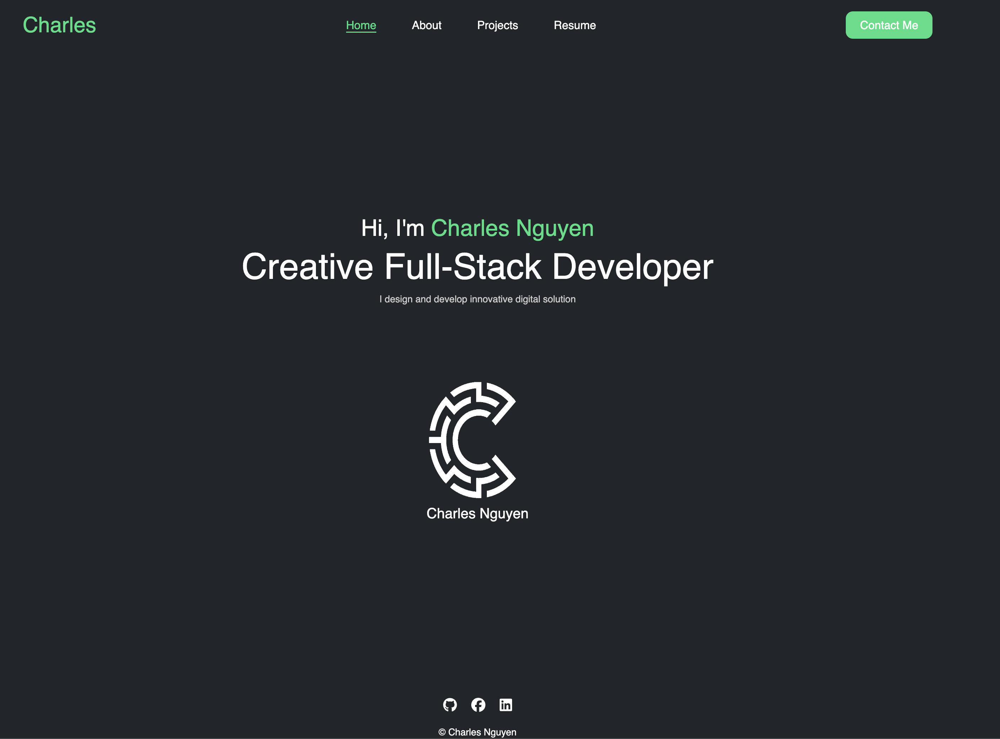
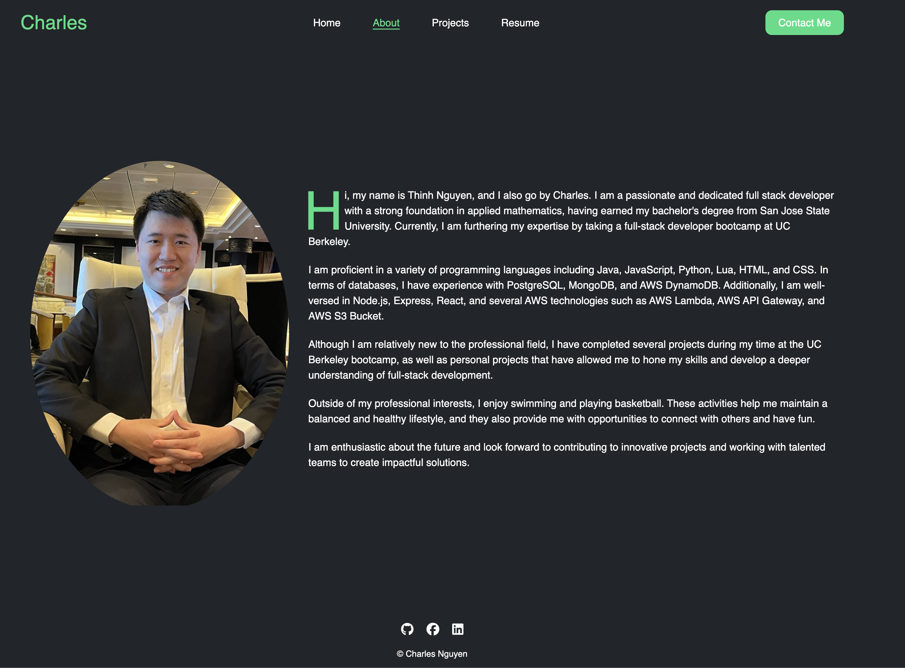

# Portfolio V2
Hello! This website is my personal website version 2, showcasing my work, skills, and projects. It’s designed with a focus on clean design, smooth user experience, and modern web technologies.
# Features
* Responsive Design: The site is fully responsive, ensuring a seamless experience across all devices.
* Modern Technologies: Built using Vite, React, and modern CSS techniques for fast loading and smooth transitions.
* Project Showcase: Explore detailed pages for each of my projects, including descriptions, technologies used, and links to demos and code repositories.
# Getting Started
* ```git clone git@github.com:swe-thinhnguyen1701/portfolio-v2.git```
* ```cd portfolio-v2```
* ```npm install```
* ```npm run dev```
# Images
## HOME PAGE

## ABOUT ME PAGE

# Deployment
This project is deployed on Netlify. You can view the live version of the website [here](https://dashing-rugelach-9db06a.netlify.app/). Ensure to set up the _redirects file in the public directory to handle routing correctly on Netlify.